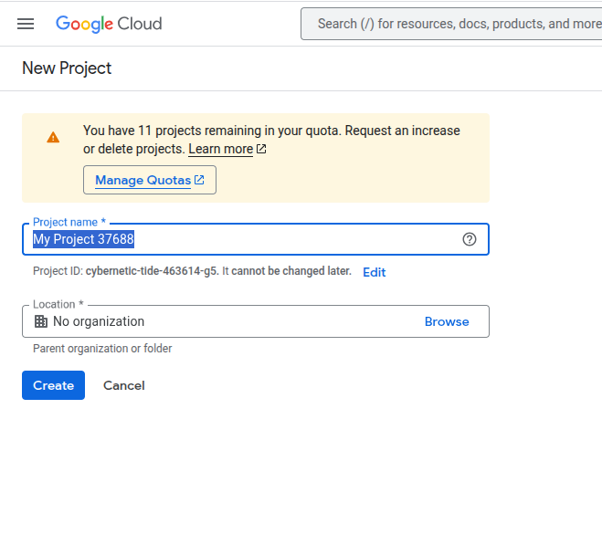
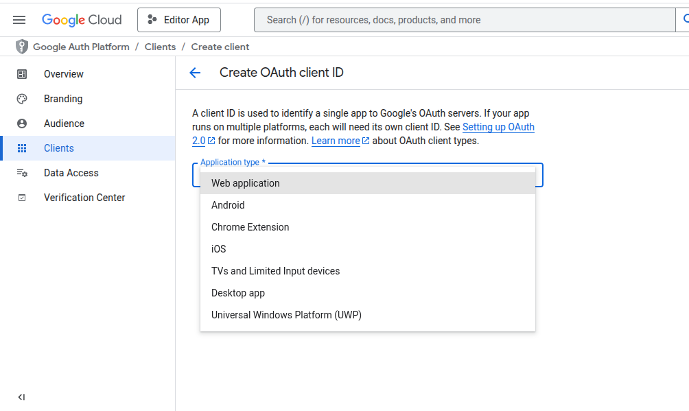
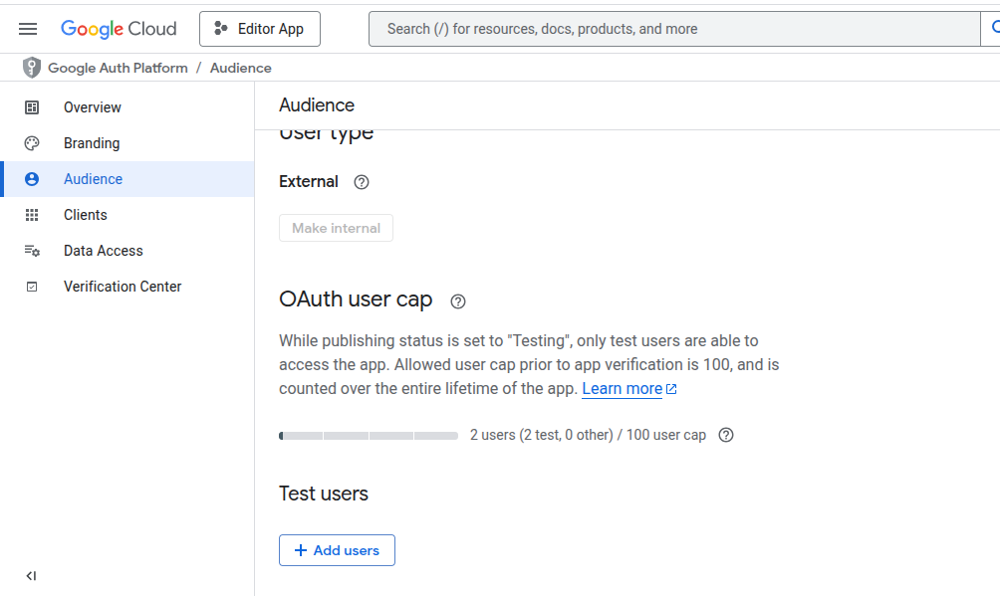
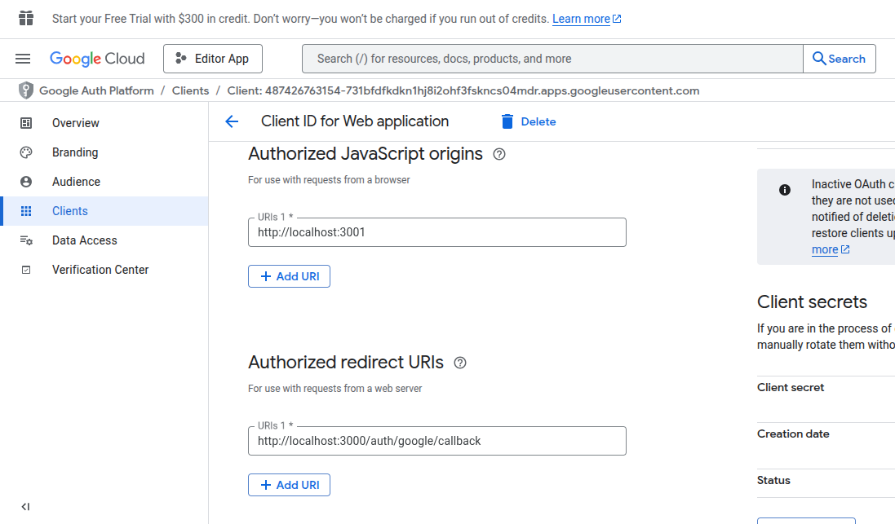
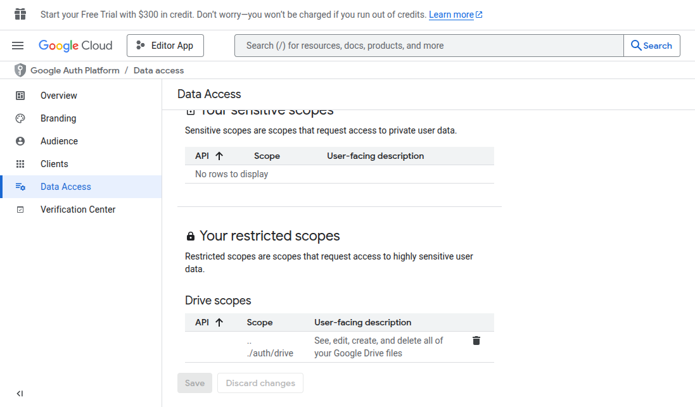

# EDDITOR
#### Edditor is a rich text editor built using React.js, Express.js and other libraries.

## Features ✨

- Seamless Google Oauth Login.
- Rich text editor.
- Download your work locally in a document format.
- Save your work to your Google Drive (this feature is limited).
- Work will be saved inside folder ``edditor_saves`` (no need to create the folder separately).

NOTE: Saving to google drive requires the developer to publish their app into Google Marketplace (includes purchases). Visit [Google Drive API](https://support.google.com/cloud/answer/13463073?visit_id=638861147527513797-2448590221&rd=1) for more details. 

- Here we are utilizing [Test users](#1-google-console-setup) (Limited to Dev).

## Demonstration 🎞️
[Demonstration Video](https://youtu.be/_uJ5K92zylA)

## Tech Stack 🤖

- React.js / Typescript
- Express.js
- Quill.js
- Passport.js
- TailwindCSS
- Google Drive API
- Express session

## Setup ⚒️ and Run ⚙️

### 1. Google Console Setup
- Create a project in the console.



- Choose the newly created project and create a client - which will give the "Client ID and Client Secret.



- Configure Audience / Test users.
NOTE: only the added test users will be able to login and upload their work to their respective google drives. 



- Select the above created client and set "Authorized Origins" and "Authorized redirect URIs" .



- Go to Data Access tab and set appropriate scopes.



### 2. App Setup & Running locally

1. Clone the repo ``git clone https://github.com/pradeept/Edditor.git``
2. Create .env files inside client and server folder. Follow .env.example for reference.
3. Open the terminal, install dependencies & run backend - ``cd server`` , ``npm run i`` then run ``nodemon server.js`` or ``node server.js`` ;
4. Install dependencies for client ``cd ../client`` , ``npm i`` and run ``npm run dev``.
5. Frontend will be live at ``http://localhost:3001``
6. Backend will be live at ``http://localhost:3000``

## Example .env 🗝️
📄.env.example
```
PORT=3000
GOOGLE_CLIENT_ID=""
GOOGLE_CLIENT_SECRET=""
SESSION_SECRET="secret"
GOOGLE_CB_URL="http://server_adress/auth/google/callback"
CLIENT_HOST="client address"
SERVER_HOST="server address"
```


